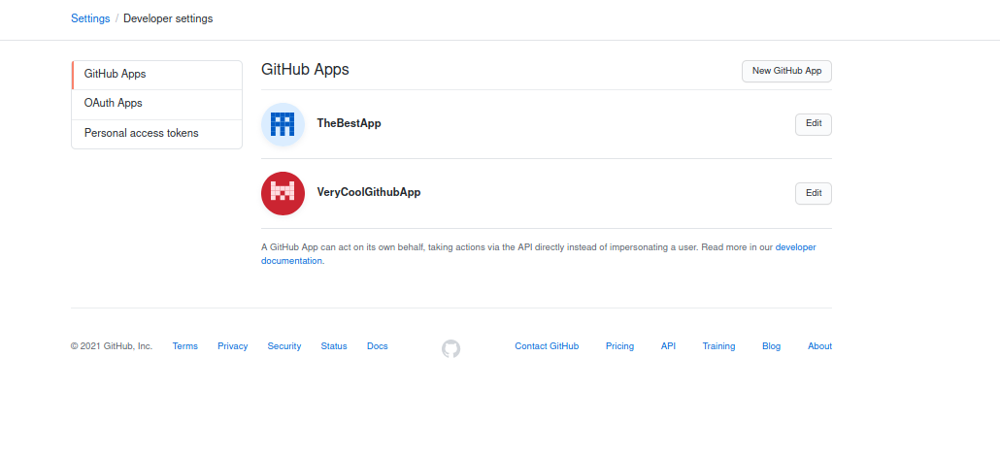
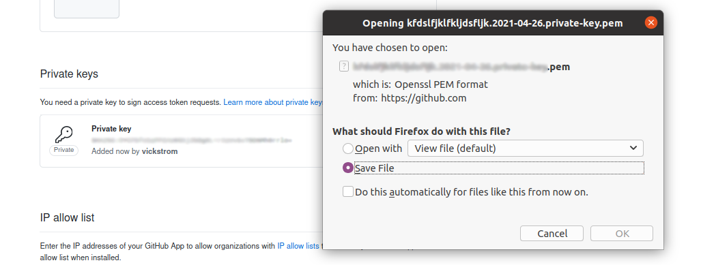

# Tutorial: MLOps - Automation of Model Evaluation 

__Authors__: [Oscar Almqvist](https://github.com/oscaralmqvist) and [Eric Vickström](https://github.com/vickstrom)


This tutorial aims to automate the evaluation of a Machine Learning repository using webhooks on __GitHub__. The process of evaluating the effect of particular on the training set is tedious, especially if you weren't the author. This tutorial will teach how you automate the testing process for a specific pull request assigned to a certain label, and comment then results on the respective pull request. 

## Showcase 
    

## Table of Contents
- [Tutorial: MLOps - Automation of Model Evaluation](#tutorial-mlops---automation-of-model-evaluation)
  - [Showcase](#showcase)
  - [Table of Contents](#table-of-contents)
  - [Overview](#overview)
    - [Prerequisites](#prerequisites)
    - [Tutorial Outline](#tutorial-outline)
    - [The Machine Learning Project Structure](#the-machine-learning-project-structure)
    - [Required Dependencies](#required-dependencies)
  - [A server that listens on pull request events](#a-server-that-listens-on-pull-request-events)
    - [Port Forwarding  ️](#port-forwarding--️)
  - [Storing environment variables](#storing-environment-variables)
  - [Register a GitHub App](#register-a-github-app)
    - [Webhook](#webhook)
    - [Repository permissions](#repository-permissions)
    - [Subscribe to events](#subscribe-to-events)
    - [Where to install](#where-to-install)
    - [Get private key](#get-private-key)
    - [Install the app](#install-the-app)
  - [Evaluating our Pull Requests](#evaluating-our-pull-requests)
  - [Commenting a Pull Request](#commenting-a-pull-request)
  - [Connecting the dots](#connecting-the-dots)
  - [Conclusion](#conclusion)
- [Appendix A - Example payload](#appendix-a---example-payload)


## Overview

### Prerequisites

- A GitHub account
- An ngrok account
- A public GitHub repository containing a machine learning model. We have included our own [example project](#the-machine-learning-project-structure) which you can add to your repository

All of the code in this tutorial can be found in inside the [code folder](./code), which includes code for both the [server](./code/server/server.py) and the small [machine learning project](./code/ml/demo.py); all written in `Python 3.9.4`.

### Tutorial Outline

The generel steps to complete our goal is described below. In further sections, there will be more detailed instructions.

1. A server that listens on pull request events.   

    For every event on GitHub, you have the option to specify an HTTP endpoint where you want to retrieve data regarding the event. In our case, we want to listen to the event of creation of a pull request. To listen, we need to create a webserver than listens for a __PUSH event__ for a specific endpoint. To be able to specify which endpoint and later on access the [GitHub API](https://docs.github.com/en/rest), we need to install our own [GitHub App](https://docs.github.com/en/developers/apps) on the specific repository.
   
2. Evaluate the model inside the pull request.  
   The data in the __PUSH event__ contains the necessary information to evaluate the changes in the pull request. With this, we will clone the repository, evaluate and compare both the __HEAD__ and the __BASE__ of the pull request. Then we train and test the model against the test sets for each version of the code. This will be done by executing shell-commands via Python.

3. Comment the results   
   The result from the evaluation will be sent as comment on a pull request via the [GitHub API](https://docs.github.com/en/rest). To do this, we need to authenicate via our [GitHub App](https://docs.github.com/en/developers/apps). 

<!--- __PROOF OF CONCEPT__ AND SHOULD NOT BE USED IN __PRODUCTION__. --->

> ⚠️ The application created assumes that the code in the pull request is safe, if an unauthorized person decide to put in faulty code, it would run on your server. Proper security measures needs to be added. ⚠️️️️️

### The Machine Learning Project Structure
In this tutorial we're using Python along with the [Keras](https://keras.io/) and [Tensorflow](https://www.tensorflow.org/) libraries to create a simple model to classify digits from the MNIST dataset. This can of course be modified to your own setup, but for the sake of the tutorial, we have included a folder containing a model located [here](./code/ml). This includes instructions on how to run it. For simplicity sake, we download the MNIST using [`keras.datasets`](https://www.tensorflow.org/api_docs/python/tf/keras/datasets/mnist/load_data). 

Essentially, the included code does the following steps:     
* Downloads the dataset,
* Preprocesses the data,
* Creates the model,
* Compiles the model,
* Trains the model,
* Evaluates it. 

After all of these steps are done, it saves the result to a file to a folder. In our case, it is saved as `result.txt` with a JSON object containing the loss and accuarcy.
```python
# result.txt
{'loss': 1, 'accuracy': 1}
```
> ⚠️  Remember that the results file produced from the model must match the file that the server is supposed to read from! ⚠️  

    

### Required Dependencies

This has been tested on `ubuntu-20.04` with the following Python modules:

For the server:   
`flask=1.1.2`    
`python-dotenv=0.17.0`     
`cryptography=3.4.7`
`pyjwt=2.1.0`

For the machine learning project:  
`numpy=1.20.2`  
`tensorflow=2.4.1`

To install the latest versions of the dependencies, either use `pip3 install <module>` for each module, or use the included `requirements.txt` for the [server](./code/server/requirements.txt) and the [machine learning project](./code/ml/requirements.txt). This can be installed via `pip3 install -r <requirements file>`. We recommend using some form of python environment manager, for instance, [Conda](https://docs.conda.io/en/latest/).

## A server that listens on pull request events 

Before telling GitHub, which endpoint we expect the __PUSH event__ to be sent to, we need to start listen on that specific endpoint. To listen, we will make use of the webframework [Flask](https://flask.palletsprojects.com/en/1.1.x/). First, we create a webserver in a file called `server.py` that listens on an arbitrary port, lets say `1337`, and that expects a POST-request on endpoint `/mlops-server`. This is the content: 

```python
# server.py
from flask import Flask, request

app = Flask(__name__)

@app.route('/mlops-server', methods=['POST'])
def mlops_server_endpoint():
    request_data = request.get_json()
    return 'Awaiting POST'
    
if __name__ == '__main__':
    app.run(debug=False, port=1337)
```

By running `python3 server.py`, you start the webserver. Now the server awaits a POST request at `http://localhost:1337/mlops-server`. The __POST__ request will contain JSON data in its body, which will contain all the data belonging to a pull request event. Lets get GitHub to send us these events to our endpoint.  

<!-- Hmm, what does the JSON data contain? 🤔 Don't worry, it will be explained later. Let's put this on hold and make GitHub App actually send this data to us.  -->

<!-- 
In [Appendix A](#appendix-a---example-payload) we've included a slice of what we will use later in [section 4](#4-commenting-a-pull-request). If you are interested, you can make use of `print(json.dumps(request_data, indent=2))` to see the output prettified.  -->


<!--    -->


### Port Forwarding  ️ 

The port `1337` is probably not open to the public (otherwise I recommend you to see over your security settings). Proper network configuration is beyond the scope of this tutorial as it is dependent on your server, so for debugging purposes, we and [GitHub Docs](https://docs.github.com/en/developers/webhooks-and-events/creating-webhooks) recommend [ngrok](https://ngrok.com/). The idea is that ngrok forwards the request to your local server and thus the idea of opening ports becomes a non-issue. The installation depends on your system, so we recommend following the instructions on [ngrok download](https://ngrok.com/download). You need to register, get and link your authenication token and forward the port `1337` via the command`./ngrok http 1337` (for Linux).


In our case, the endpoint our GitHub App will send its requests to, is `http://afae4b0b1670.ngrok.io/mlops-server`.


## Storing environment variables
Communicating with an API requires authenication and IDs specific to your project. The various keys and IDs we will collect in the coming parts should __not__ be uploaded to any public repository. We will handle these by a creating an environment file called `.env`. The data we need to store there is the __app ID__, the __install ID__, and the path to the __private key__.  

```bash
# .env
APP_ID=<OUR APP ID>
PRIVATE_KEY_PATH=<OUR PATH TO PRIVATE KEY>
INSTALL_ID=<OUR INSTALL ID>
```

To then access these variables, we will make use of the `dotenv` module.

```python
# server.py
import os
from dotenv import load_dotenv

load_dotenv()

INSTALL_ID = os.getenv('INSTALL_ID')
APP_ID = os.getenv('APP_ID')
PRIVATE_KEY_PATH = os.getenv('PRIVATE_KEY_PATH')
```
## Register a GitHub App

We need to create a GitHub App and install in on our machine learning repository. But why? 🧐 Webhooks can be configured without an app, however commenting on our pull request requires us to communicate via GitHub. So lets create an App. First navigate to their [app page](https://github.com/settings/apps).



Click __New GitHub App__.


We need to specify a name for our app. However, they require you to specify a website. No website? Here we could simply input the __ngrok__ url [http://afae4b0b1670.ngrok.io/](http://afae4b0b1670.ngrok.io/). We are using the default settings for all the options (_Identifying and authorizing users_, _Post installations_, etc.), expect for the following:

### Webhook
Here, we will input the URL we recieved by __ngrok__ with the added `/mlops-server` extension.


### Repository permissions
Tell GitHub, that we need access to every pull-request where we install our App.


### Subscribe to events
For the webhook, we want to listen to specific request regarding pull-requests. 


### Where to install 
We do not plan to install this everywhere and only for our repo. 


Click create. Voilá, we have our first App. 🥳


Save the __App ID__ inside `.env`
```bash
# .env
APP_ID=347128
```

### Get private key
In the future, we need to authenticate as the app through our server, so generate a private-key! This is found at the bottom of the same page.


Download it and keep it safe! Save the path to the key to `.env`. 



```bash
# .env
APP_ID=347128
PRIVATE_KEY_PATH=path/to/key.pem
```

### Install the app

Scroll up, and click on __Install App__. 

Choose that you want to install the app for one of your repositories. 


Here, select your machine learning repository. Hopefully, your project name is more exciting that `your-ml-project`.


Click on __Install__.


Look 👀 See the installation ID in the url? This ID is used when we want to specify which repository we want to add a comment to. Save that as well.

```bash
# .env
APP_ID=347128
PRIVATE_KEY_PATH=path/to/key.pem
INSTALL_ID=92312521
```

Wow, that was a lot of steps.😮‍💨 The good news are that we're done with registrering the GitHub App. Let's continue with our server! 

## Evaluating our Pull Requests 
Okay, now we have our server that tells us when someone has created a pull request and we have a model. Let's combine the two; train & evaluate the model when someone has created a pull request!

The plan is to have the __server__ clone the repository, checkout the latest __commit__, install all the dependencies, evaluate the model against the base. To do this, we can run shell-commands via Python. To do this, we utilize the module `subprocess` and the method `run()`. First, we clone and change the folder name to an arbitrary string `project_dst`, with the help of module `uuid`; the reason for this is to avoid collisions with folders that already exist. Next, we `checkout` a specific version of the cloned repository (with `cwd` we change our current directory inside the `project_dst` folder). Then, we install the dependencies of the machine learning project, and test the model expecting a `result.txt`. For future pull requests, we can't use the same cloned directory, so we move the directory to the 🗑️ ️️ 

<!-- Lastly, we will clean up after ourselves and load the results from `result.txt`.    -->

```python
# server.py
import subprocess

def evaluate_pull_request(commit_sha, html_url):
    project_dst =  uuid.uuid4().hex
    subprocess.run(["git", "clone", html_url, project_dst])
    subprocess.run(["git", "checkout", commit_sha], cwd=f"./{project_dst}")
    subprocess.run(["pip", "install", "-r", f"{project_dst}/requirements.txt"])
    subprocess.run(["python3", f"{project_dst}/demo.py"])
    subprocess.run(["rm", "-rf", project_dst])
    
    with open(f"result.txt", "r") as f:
        return json.load(f) 
```
> Notice how we depend on the project layout via the paths here (`{project_ds}/requirements.txt` and `{project_dst}/demo.py`). If you use your own project, make sure you call the correct files!

> If you want to supress the output from `run()` you can add redirect the `stdout` and/or `stderr` to `subprocess.DEVNULL`. See [server.py](./code/server/server.py) for how we did it!

What data from the __pull request__ do we need? Well, we need the `html_url` of the repository in order to __clone it__ and then `commit_sha` in order to __checkout__ the latest changes. Note that we need the `html_url`  and `commit_sha` of both the _head_ and _base_ as we want to compare the changes. Additionally, we need the `comments_url` to have our application comment the results on the __pull request__. Let's create two utility functions for this:

```python
# server.py
def get_commits(data):
    return data["pull_request"]["head"]["sha"], \
           data["pull_request"]["base"]["sha"]

def get_urls(data):
    return data["pull_request"]["comments_url"], \
           data["pull_request"]["head"]["repo"]["html_url"], \
           data["pull_request"]["base"]["repo"]["html_url"]
```

We also need to specify _when_ this could be run. For instance, if we just made a pull request that updated documentation or similar, we don't need to run all of this testing as the model hasn't been changed. To solve this, we will create a __label__ in our repository which is treated as a flag for letting our server know when to evaluate it. We will call this label __evaluate__. This also means that we need to create some form of validation function that asserts if it's a valid response intended for testing and comparing the model. In the case of GitHub webhooks, we want to listen of the `labeled` action for a `pull_request`. We also need to see if it contains our label.

```python
# server.py
def is_valid_response(data):
    is_valid = False
    keys = data.keys()
    if 'pull_request' in keys and 'action' in keys:
        if data['action'] != 'labeled':
             return False 
        
        for label in data['pull_request']['labels']:
            if 'evaluate' == label['name']: # 'evaluate' corresponds to said label
                is_valid = True 

    return is_valid 
```

Now, let's glue everything together inside `mlops_server_endpoint()`. 

```python
# server.py
from flask import Flask, request

@app.route('/mlops-server', methods=['POST'])
def mlops_server_endpoint():
    response = request.get_json()

    if is_valid_response(response):
        sha_head, sha_base = get_commits(response)
        comments_url, url_head, url_base = get_urls(response)

        head_result = evaluate_pull_request(sha_head, url_head)
        base_result = evaluate_pull_request(sha_base, url_base)

        # TODO: send comment with results to pull request

    return 'Awaiting POST'
```
## Commenting a Pull Request 
In [section 1](#1-listen-on-the-pull-request-event), the communication with the repository was rather one-sided; the server could only _listen_ to __Webhook events__. In order to send requests _to_ our repository, we need to add functionality. First of all, we need to fetch an __access token__. The purpose of the __access token__ is authenticate against GitHub. This is done by constructing a __JSON Web Token__ (JWT) based on the __app ID__ and __private key__ from [section 2](#2-register-a-github-app).

Let's generate our __JWT__. The different `time` fields (`iat`, `exp`) represent for how long this should be valid in terms of seconds (?).

```python
# server.py
import jwt
import time

def generate_jwt():
    pemfile = open(PRIVATE_KEY_PATH, 'r')
    key = pemfile.read()
    pemfile.close()
    payload = {
        "iat": int(time.time() - 60),
        "exp": int(time.time() + (10 * 60)) - 10,
        "iss": APP_ID
    }
    return jwt.encode(payload, key, algorithm="RS256") 
```

Using `generate_jwt()` we create a function for fetching the __access token__, which essentially sends a `POST` request to `https://api.github.com/app` in order to fetch an access token for a certain __GitHub app__.

```python
# server.py
import json

GITHUB_APP_URL = "https://api.github.com/app"

def get_token():
    headers = {
        "Authorization": f"Bearer {generate_jwt()}",
        "Accept": "application/vnd.github.v3+json"
    }
    r = requests.post(f"{GITHUB_APP_URL}/installations/{INSTALL_ID}/access_tokens", headers=headers)
    return r.json()["token"]
```

To later post a message on a certain __pull request__, we use the __access token__ to send a `POST` request with a body containing our message.

```python
# server.py
def post_message_on_pull_request(comments_url, token, message):
    headers = {
        "Authorization": f"token {token}",
        "Accept": "application/vnd.github.v3+json"
    }
    payload = {
        "body": message
    }

    requests.post(comments_url, headers=headers, data=json.dumps(payload))
```

## Connecting the dots
Finally, we can assemble everything to evaluate a model from a certain pull request and send the results! If we would like, we could also format our message to make them more readable, kind of like this: 

| Source| Loss           | Accuracy            |
| ------| ---------------| ------------------- |
| Head  | 1.07 | 78.0% |
| Base  | 1.06 | 80.0% |
| Diff  | 0.01    | -2.0%         |

Let's create a utility function that creates a Markdown table with the data based on the `loss` and `accuracy` from what the pull request contains (_head_) and to where it's going (_base_). 

```python
# server.py
def format_markdown_comment(head, base):
    diff_loss = round(head['loss'] - base['loss'], 2)
    diff_acc = round(head['accuracy'] - base['accuracy'], 2)
    rows = [
        f"| Source| Loss           | Accuracy            |",
        f"| ------| ---------------| ------------------- |",
        f"| Head  | {head['loss']} | {head['accuracy']}% |",
        f"| Base  | {base['loss']} | {base['accuracy']}% |",
        f"| Diff  | {diff_loss}    | {diff_acc}%         |"
    ]
    return "\n".join(rows)
```

Now, add these to the `mlops_server_endpoint()`.

```python
# server.py
@app.route('/mlops-server', methods=['POST'])
def mlops_server_endpoint():
    response = request.get_json()

    if is_valid_response(response):
        sha_head, sha_base = get_commits(response)
        comments_url, url_head, url_base = get_urls(response)

        head_result = evaluate_pull_request(sha_head, url_head)
        base_result = evaluate_pull_request(sha_base, url_base)

        message = format_markdown_comment(head_result, base_result)

        token = get_token()
        post_message_on_pull_request(comments_url, token, message)
    return 'Awaiting POST'
```

## Conclusion

Start your server `python3 server.py`.

If you now open a pull request and add an `evaluate` label you should see that this application works! This tutorial contains a proof-of-concept of how one could build a server to evaluate pull requests containing ML models. This can hopefully be altered to _your_ needs and inspire to automate more parts of _your_ development process!   

  

# Appendix A - Example payload
An example subset of what a pull request event can contain. If you can't wait and are interested in seeing a full payload from a request, you may visit the [GitHub docs](https://docs.github.com/en/developers/webhooks-and-events/webhook-events-and-payloads#webhook-payload-example-33). You can also read more about [webhooks here](https://docs.github.com/en/developers/webhooks-and-events/about-webhooks).
```json
{
  "action": "opened",
  "number": 3,
  "pull_request": {
    "comments_url": "https://api.github.com/repos/vickstrom/your-ml-project/issues/3/comments",
    "head": {
      "sha": "89243d3490e9c0djk3as8791b84bc05a42837a363a",
      "repo": {
        "html_url": "git@github.com:vickstrom/your-ml-project.git",
      }, 
    },   
    "base": {
      "sha": "45as43d3490e9c0djk3as8791b84bc05a42837a363a",
      "repo": {
        "html_url": "git@github.com:vickstrom/your-ml-project.git",
      }, 
    },   
    "labels": [{
        "name": "Evaluate",
    }],
  }
}
```